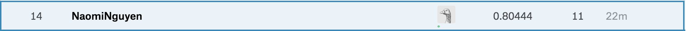

# PREDICT CUSTOMER RESPONSE FOR ARVATO FINANCIAL SERVICES
Predict response for a marketing campaign's target for Arvato Financial Service. Data is provided by Arvato Financial Service. This is the project under Udacity ML Nanodegree

## Dependencies

- pandas
- numpy
- matplotlib
- scipy
- xgboost

## Data
Provided by Arvato Financial Service: Demographics data on
- `train.csv`: campaign targets with an additional column `RESPONSE`, which we try to predict
- `azdias.csv`: subset of population in Germany
- `customers.csv`: company's customers

The data for this project consist of two files:

- Udacity_AZDIAS_Subset.csv: demographics data for the general population of
      Germany; 891211 persons (rows) x 85 features (columns)
- Udacity_CUSTOMERS_Subset.csv: demographics data for customers of a mail-order
      company; 191652 persons (rows) x 85 features (columns)

## Contents
- Data provided by Arvato Financial Service
- `intermediate`: model files
## Performance on Kaggle's public leaderboard

## License
The project is under MIT License